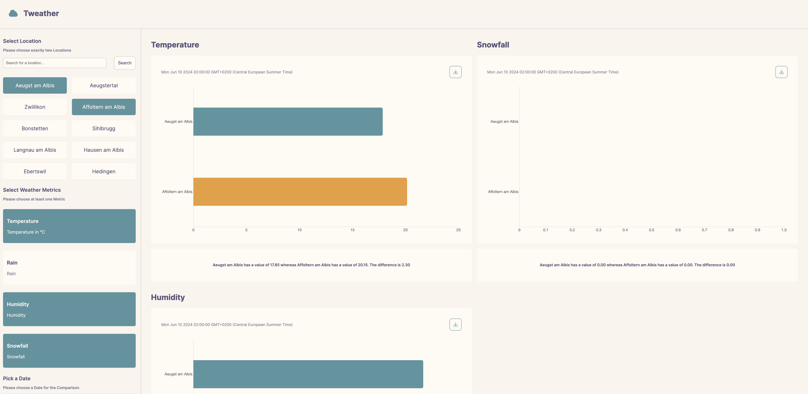

# :sun_behind_small_cloud: FHR Tweather App
Tweather makes it easy to compare two different locations in Switzerland depending on your defined metrics. Therefore allowing you to pick out the location which fits your needs the most. The name Tweather itself is a pun on Tinder for Weather Locations (find your suitable location depending on your Preferences) This project was done as part of the SAD (Software Architecture and Design) Module @FHGR.

## Screenhots
Here's what the Web Application Looks like. Kudos for the Colors goes to [Rosé Pine](https://rosepinetheme.com/).



## Prerequisites

> :warning: Please make sure you have the following tools installed on your system

- [Python](https://www.python.org/) >= v.3.11
- [NodeJs](https://nodejs.org/en) >= v.21.0
- [Chrome](https://www.google.com/chrome/) a somewhat modern Version of Chrome which supports WebComponents (>= Version 67)


## Preprocessing
The API we use to retrieve the Weather Information is called [Open Meteo](https://open-meteo.com/en/docs). The API works with passing in the Longitude and Latitude values of the location which Weather Metrics you want to know. As the purpose of this process was to support Locations based in Switzerland we used the following [CSV](https://www.swisstopo.admin.ch/de/amtliches-ortschaftenverzeichnis) file as a base. However the entries in that CSV File are do not contain Longitude and Latitude values. To get around this a small Python Script was written which takes each Location, calculates the correct Latitude and Longitude values and saves the result back as a JSON File.
The script can be found under `scripts/preprocess_city_names.py` and does the following things:

- Generate a JSON File called `cities.json`
- Converts LV95 Coordinates into Latitude and Longitude Coordinates
- Extracts city name as well as postal code

## Setup
These steps only need to be done one time.

### Backend
First change into the `backend` directory and create a `virtual environment`. Run the following commands depending on your Operating System:

#### MacOS and Linux

```bash
cd backend
python3 -m venv ./venv
source ./venv/bin/activate
```

Then install all required packages `see dependencies in pyproject.toml`:

```bash
pip3 install .
```

#### Windows

```bash
cd backend
python -m venv ./venv
source .\venv\Scripts\activate.bat 
```
Then install all required packages `see dependencies in pyproject.toml`:

```bash
pip install .
```

### Frontend
Change into the `frontend` directory and install all required packages by runnin the following command:

```bash
cd backend
npm i
```

## Architecture
The Application is split up into a `frontend` and `backend` Part.

### Frontend
The frontend is a simple HTML5 Appliation which displays the results coming from the backend. The following Technologies were used for the development of the frontend:

- [Vite](https://vitejs.dev/) - Frontend Tool Kit (Webbundler)
- [Rose Pine](https://rosepinetheme.com/palette/) - Used Color Scheme
- [ChartJS](https://www.chartjs.org/) - Chart Library

### Backend
The backend itself is written with Python and [FastApi](https://fastapi.tiangolo.com/). For the actual weather metrics themselves [Open Meteo](https://open-meteo.com/) was used.

For more information about the Software Architecture also see `doc/architecture.md`.

## Main Packages

> Please note that in order for this to work you have to have your Virtual Environment activated.

The Backend is split up into three different packages. The Main Application Entry Point is the `analyze` package.

In order to get a feel at how to use the different packages a corresponding `__main__.py` file was created. In order to run it for a corresponding package run the following command (depending on your Operating System)

### MacOS and Linux
```bash
cd backend
python3 -m data # Runs the __main__.py file for the data package
python3 -m location # Runs the __main__.py file for the location
python3 -m analyze # Runs the __main__.py file for the analyze package
```
### Windows
```bash
cd backend
python -m data # Runs the __main__.py file for the data package
python -m location # Runs the __main__.py file for the location
python -m analyze # Runs the __main__.py file for the analyze package
```

## Unit Tests
For the different packages some Unit Tests were also implemented. In order to run them simply execute the following command (depending on your Operating System):

### MacOS and Linux
```bash
cd backend
python3 -m unittest discover -v 
```

### Windows 
```bash
cd backend
python -m unittest discover -v 
```

## Running the Application

> :warning: Please make sure that the Backend is started before the Frontend and that you have your Python Virtual Environment activated.

### Backend

> Please note that this step assumes that you have your Python Virtual Environment activated.

In order to run the Backend (Fast API) simply execute the following command:

```bash
cd backend
fastapi dev
```
The OpenAPI Page should now be available under the following [URL](http://localhost:8000/docs)

### Frontend

> Normally you do not need to edit anything as the default port `http://localhost:8000` should just work out of the box.

First please make sure that the URL inside the `frontend/.env` file matches the one from the backend (e.g localhost:8000).

```bash
VITE_API_URL=http://localhost:8000
```

In order to run the Frontend simply execute the following command:

```bash
cd frontend
npm run dev
```
After running this command a Browser Window should automatically open.
