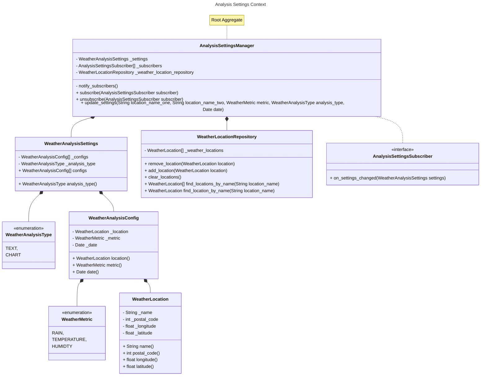
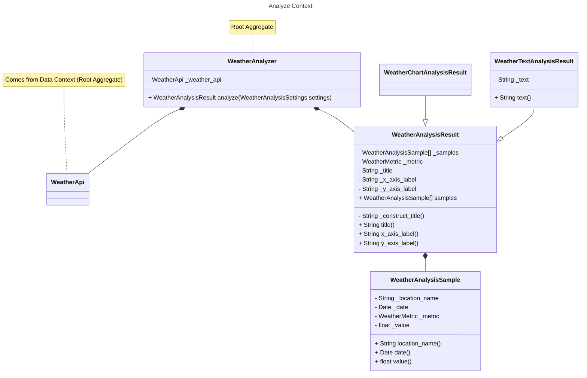
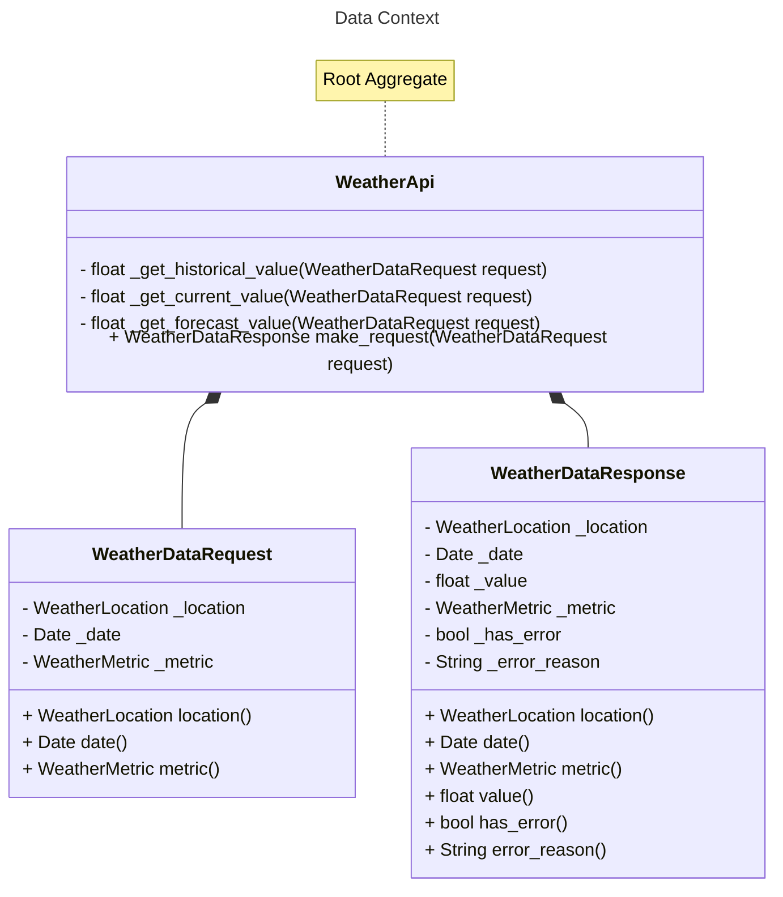
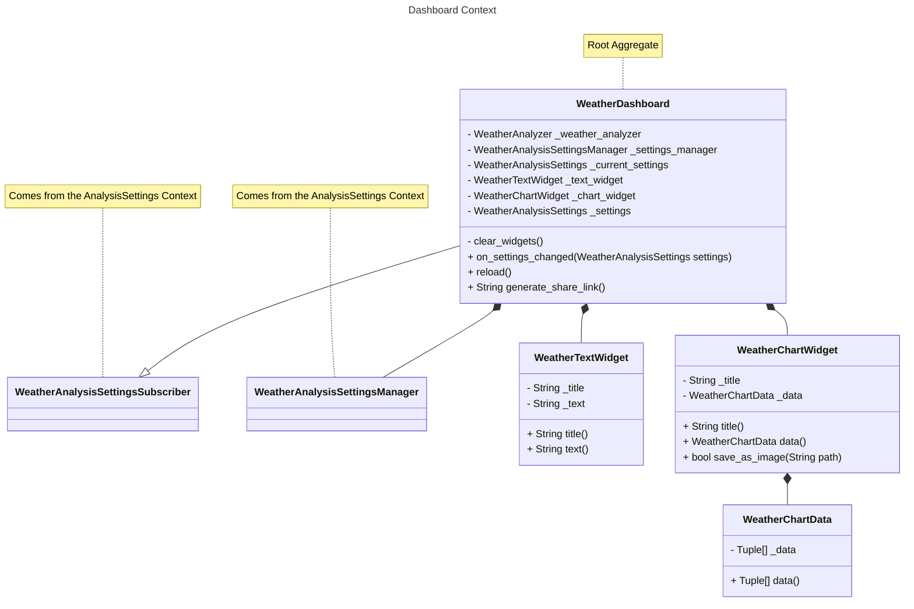
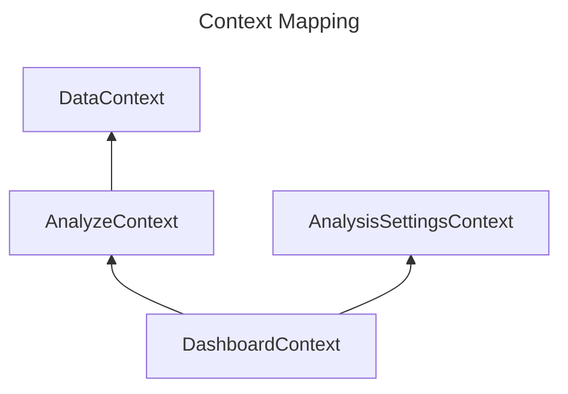

# Architecture
The architecture is split into different parts. First the differente Context (building blocks) of the Application are explained. Afterwards it is described how these builidng blocks interact with each other.

## Context
The whole applications is split up into `different context`. Each context serves a specific puprose. Communication between contexts is done via the `Aggregate Root` Object. Below you can find a short explanation for each context and its purpose

|Context|Description|
|--|----|
|Analysis Settings Context|This context holds all objects related to settings needed for an Analysis|
|Analyze Context|This context holds all objects responsible for actually doing the analysis|
|Data Context|This context holds all objects responsible for retrieving and caching the actual data|
|Dashboard Context|This context holds all objects responsible for displaying the actual dashboard|

## Context Mapping

